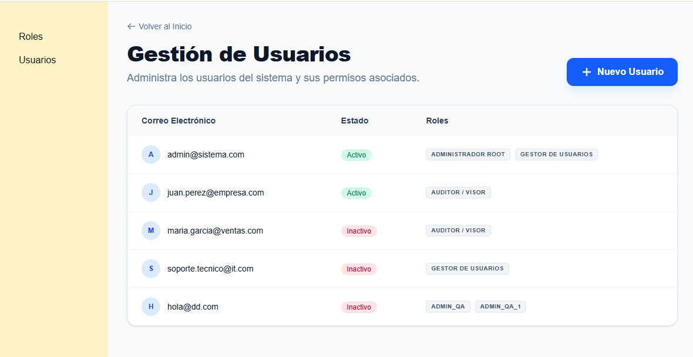

# Sistema de Gestión de Usuarios y Roles (RBAC)



Este proyecto es una plataforma administrativa diseñada para gestionar el control de acceso basado en roles (RBAC). Permite administrar usuarios, definir roles complejos y asignar permisos granulares, todo con una experiencia de usuario moderna y fluida.

## 🚀 Guía para el Revisor (Interviewer)

Este proyecto ha sido desarrollado enfocándose en la **limpieza del código**, **reusabilidad** y **experiencia de usuario (UX)**. A continuación, los puntos clave para revisar:

### 1. Gestión de Roles (`/roles`)
- **Generación Automática de Códigos**: Al crear un rol, el sistema genera un identificador único en tiempo real.
- **Validación de Unicidad**: Si el código generado ya existe, el sistema añade automáticamente un sufijo numérico y muestra un indicador visual de "bloqueo" (icono de candado) para señalar que es un valor controlado.
- **Asignación de Permisos**: Interfaz intuitiva para seleccionar múltiples capacidades del sistema.
- **Aesthetics**: Diseño limpio con inputs en mayúsculas automáticas y feedback visual inmediato.

### 2. Gestión de Usuarios (`/usuarios`)
- **Creación Masiva**: El campo de email acepta múltiples direcciones separadas por comas. El sistema valida cada una individualmente y crea registros independientes.
- **Sincronización de Datos**: El formulario de usuarios consume dinámicamente los roles creados en la sección anterior.
- **Estados**: Control de estado (Activo/Inactivo) para cada usuario.

### 3. Arquitectura y Lógica
- **Custom Hooks (`app/hooks/useStorage.ts`)**: Se implementó un hook robusto para manejar la persistencia en `localStorage`. Este hook se encarga de:
    - Sincronizar el estado de React con el navegador.
    - Cargar datos iniciales (Mocks) si el storage está vacío.
    - Manejar errores de parseo de forma segura.
- **Componentes Reutilizables**: El `Modal` es un componente desacoplado que utiliza las API nativas del navegador (`dialog`) para mayor accesibilidad y rendimiento.
- **Validaciones**: Uso intensivo de `react-hook-form` para validaciones complejas de esquemas, patrones de email y obligatoriedad de campos.

## 🛠️ Tecnologías Utilizadas

- **Framework**: Next.js 14+ (App Router)
- **Lenguaje**: TypeScript
- **Estilos**: Tailwind CSS (con enfoque en diseño premium y minimalista)
- **Formularios**: React Hook Form
- **Persistencia**: LocalStorage API
- **Iconografía**: SVG personalizado / Lucide-like icons

## 📦 Instalación y Uso

1. Clonar el repositorio.
2. Instalar dependencias:
   ```bash
   npm install
   ```
3. Ejecutar en modo desarrollo:
   ```bash
   npm run dev
   ```
4. Abrir [http://localhost:3000](http://localhost:3000).

## 📂 Estructura del Proyecto

- `/app`: Rutas del sistema (Roles, Usuarios) y Layout principal.
- `/app/components`: Componentes UI reutilizables (Modal).
- `/app/hooks`: Lógica de negocio extraída (Persistencia).
- `/data`: Archivos JSON con permisos, roles y usuarios iniciales.

---
*Desarrollado como una prueba técnica de alta calidad para demostrar habilidades en Frontend y Arquitectura de Software.*
